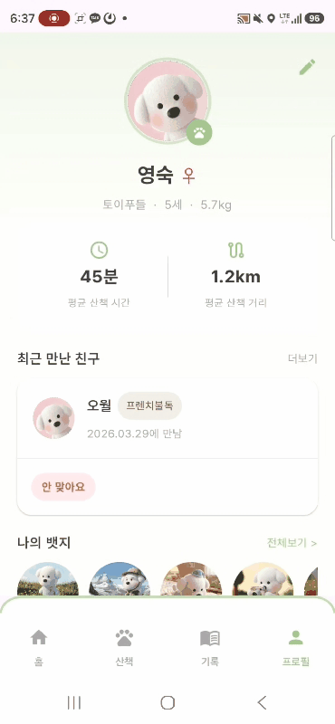
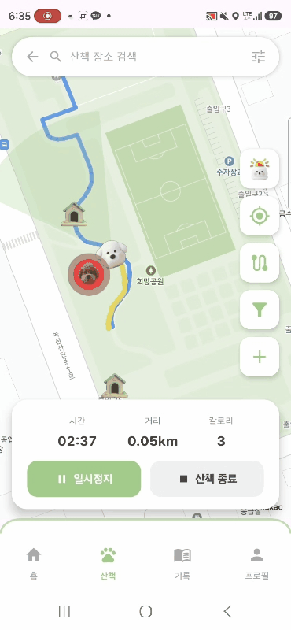
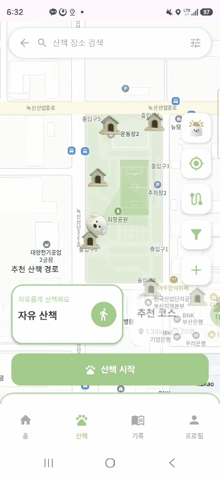
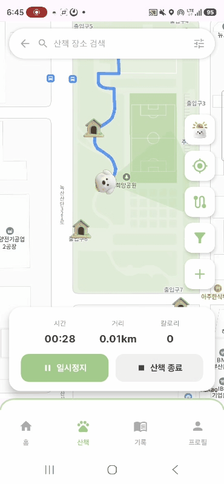

# 🐾 댕동여지도
> **빅데이터 기반 반려견 맞춤 산책 추천 서비스**

위치 기반 데이터를 활용하여  
반려견에게 최적의 산책 코스를 추천하고  
위험 요소를 실시간으로 알려주는 서비스


### 📅 프로젝트 정보
- **기간** : 2026.02.16 ~ 2026.04.03 (7주)
- **인원** : 6명
- **플랫폼** : Android App
- **기관** : 삼성 청년 SW·AI 아카데미 14기 

<p align="center">
  
</p>

---

## 🔎 목차

<div align="center">

### <a href="#developers"> 👥 팀원 구성</a>
### <a href="#background"> 📌 기획 배경</a>
### <a href="#skills">✨ 주요 기능</a>
### <a href="#techStack">🛠 기술 스택</a>
### <a href="#systemArchitecture">🌐 시스템 아키텍처</a>
### <a href="#erd">🗂️ ERD</a>
### <a href="#directories">📂 프로젝트 구조</a>
### <a href="#api">🔗 외부 서비스 연동</a>

</div>

<br>

## 👥 팀원 구성
<a name="developers"></a>

<div align="center">

<div align="center">
<table>
    <tr>
        <td width="33%" align="center"> <a href="https://github.com/hjh1248">
             <br> 하정호 <br>(BE & AI & Leader) </a> <br></td>
        <td width="33%" align="center"> <a href="https://github.com/sehyeon262">
             <br> 김세현 <br>(BE & FE) </a> <br></td>
        <td width="33%" align="center"> <a href="https://github.com/Seorins">
             <br> 박서린 <br>(BE Leader & FE & AI) </a> <br></td>
    </tr>
    <tr>
      <td width="280px" valign="top">
        <sub>
          - 프로젝트 일정 관리 및 피드백<br>
          - 빅데이터 기반 개인화 경로 추천 알고리즘 구현<br>
          - 데이터 수집 및 DB 적재 파이프라인 구현<br>
          - 장소 도메인 API 및 PostGIS 기반 위치 데이터 처리<br>
          - 프로젝트 발표
        </sub>
      </td>
      <td width="280px" valign="top">
        <sub>
          - 위험구역 신고 및 조회 기능 전반 설계 및 구현<br>
          - 산책 시작, 종료, 시간 조회 기능 서버 로직 및 API 개발<br>
          - WebSocket 기반 실시간 채팅 기능 구현 및 프론트엔드-백엔드 연동<br>
          - 지도 기반 산책 화면 UI 개발 및 사용자 인터랙션 구현<br>
          - 장소 상세 정보 화면 구현 및 데이터 연동
        </sub>
      </td>
      <td width="280px" valign="top">
        <sub>
        - 홈화면 날씨 기반 산책 적합도 판단 기능 설계 및 구현<br>
        - 강아지 감정 분석 AI 모델 개발 및 ONNX 기반 추론 파이프라인 구축<br>
        - AI 산책 일기 자동 생성 기능 설계 및 구현<br>
        - 산책 촬영 사진 자동 업로드 기능 구현<br>
        - 배지 시스템 설계 및 구현<br>
        - Wear OS 스마트워치 앱 개발 및 실시간 데이터 통신 구현
        </sub>
      </td>
    </tr>

</table>

<table>
    <tr>
        <td width="33%" align="center"> <a href="https://github.com/dain2822">
         <br> 심다인 <br>(BE & FE Leader) </a> <br></td>
        <td width="33%" align="center"> <a href="https://github.com/gunbread0418">
         <br> 임건빈 <br>(BE & FE & Infra) </a> <br></td>
        <td width="33%" align="center"> <a href="https://github.com/SPh0052">
         <br> 황인후 <br>(BE & FE) </a> <br></td>
    </tr>
    <tr>
        <td width="280px" valign="top"> 
          <sub>
          - 로그인 / 회원가입 / 자동 로그인 기능 구현<br>
          - 반려견 프로필 조회 및 수정 기능 구현<br>
          - 산책 중 주변 반려견 지도 표시 및 함께 산책 제안 기능 구현<br>
          - 스마트워치 연동 초기 세팅
          </sub>
        </td>
        <td width="280px" valign="top">
          <sub>
          - 서비스 전반 인프라 아키텍처 설계 및 구축 담당<br>
          - 서버 배포 환경, 네트워크, 데이터베이스, 운영 환경 구성 및 관리<br>
          - 위험구역, 비선호 강아지, 알림 기능 백엔드 API 설계 및 구현<br>
          - 위험구역, 비선호 강아지, 알림 기능 프론트엔드 화면 구현 및 연동<br>
          - Tmap API 연동을 통한 경로 탐색 및 지도 경로 시각화 구현
          </sub>
        </td>
        <td width="280px" valign="top">
          <sub>
          - 실시간 GPS 추적·경로 기록·지도 구현 및 산책 시작/종료 플로우 개발<br>
          - 장소 등록, 발자국 도장 풀스택 구현 (BE API + Android)<br>
          - 위험구역 신고 구현(Wear OS)<br>
          - 산책 코스 선택 Wear OS 연동, 산책 거리·시간·칼로리 계산 API 구현
          </sub>
        </td>
    </tr>

</table>
</div>
<br>

</div>


---


## 📌 기획 배경

<a name="background"></a>

108명의 반려견 보호자를 대상으로 설문조사를 실시한 결과,<br>
산책 과정에서 반복적으로 겪는 불편이 명확하게 드러났습니다.

| 순위 | 불편함 | 응답 수 |
|------|--------|---------|
| 1위 | **새로운 산책 코스 부족** — 매번 같은 길만 반복 | 57명 |
| 2위 | **다른 반려동물과의 충돌** — 예기치 못한 상황에 대한 불안감 | 40명 |

단순한 불편처럼 보이지만,<br>
이는 결국 **산책의 질을 떨어뜨리고 보호자의 스트레스를 유발하는 핵심 문제**였습니다.

이에 따라, 댕동여지도는 다음과 같은 문제 해결에 집중했습니다.
- 반복되는 산책 경로 → 사용자 맞춤형 산책 코스 추천
- 예측할 수 없는 충돌 상황 → 실시간 위험 구역 알림
- 산책 가능 여부 판단의 번거로움 → 날씨·대기질 기반 산책 적합도 제공
- 단순 기록에 그치는 산책 데이터 → 빅데이터 기반 학습으로 점점 개선되는 추천 시스템

---

## ✨ 주요 기능

<a name="skills"></a>

### 📱 모바일

<table>
  <tbody align="center"> 
    <tr>
    <th align="center">홈 & 프로필</th>
    <th align="center">산책 시작 & 경로 선택</th>
  </tr>

  <tr>
    <td width="50%" align="left">
      <br><br>
      - 반려견 정보 및 산책 통계 확인<br>
      - 최근 만난 반려견 기록 관리<br>
      - 뱃지 및 활동 기반 성장 요소 제공
    </td>
    <td width="50%" align="left">
      <br><br>
      - 현재 위치 기반 산책 시작<br>
      - 자유 산책 / 추천 코스 선택<br>
      - 직관적인 UI로 빠른 시작
    </td>
  </tr>
</tbody>

<tbody align="center"> 
    <tr>
    <th align="center">실시간 산책 추적</th>
    <th align="center">위험 구역 알림</th>
  </tr>

  <tr>
    <td width="50%" align="left">
      <br><br>
      - GPS 기반 실시간 위치 추적<br>
      - 이동 경로 시각화 (PostGIS LINESTRING)<br>
      - 시간 / 거리 / 칼로리 실시간 표시
    </td>
    <td width="50%" align="left">
      <br><br>
      - 사용자 제보 기반 위험 구역 표시<br>
      - 접근 시 실시간 경고 알림 제공<br>
      - 안전한 산책 환경 지원
    </td>
  </tr>
</tbody>

<tbody align="center"> 
    <tr>
    <th align="center">추천 경로 & 홈 화면</th>
    <th align="center">AI 산책 일기</th>
  </tr>

  <tr>
    <td width="50%" align="left">
      <br><br>
      - 주변 산책 가능 장소 추천<br>
      - 사용자 데이터 기반 맞춤 코스 제공<br>
      - 날씨 및 환경 정보 반영
    </td>
    <td width="50%" align="left">
      <br><br>
      - 산책 데이터를 기반으로 자동 일기 생성<br>
      - 이미지 분석 + 감정 추론 + 텍스트 생성<br>
      - 산책 기록을 스토리로 변환
    </td>
  </tr>
</tbody>
</table>

<br>

### ⌚ 스마트 워치

<table>
  <tbody align="center"> 
    <tr> <th style="text-align: center"> 산책 시작 및 종료 </th> <th style="text-align: center"> 산책 코스 선택 </th> </tr>
    <tr> <td width="50%"></td> 
        <td width="50%"></td> </tr> </tbody>
  <tbody align="center"> 
    <tr> <th style="text-align: center"> 위험 구역 설정 </th> <th style="text-align: center"> 위험 구역 알림 </th> </tr>
    <tr> <td width="50%"></td>
    <td width="50%"></td> </tr> </tbody>
  <tbody align="center"> 
    <tr> <th style="text-align: center"> 비선호 반려견 알림 </th> <th style="text-align: center"> 같이 산책하기 </th> </tr>
    <tr> <td width="50%"></td>
    <td width="50%"></td> </tr>
  </tbody>
  <tbody align="center"> 
    <tr> <th style="text-align: center"> 발자국 찍기 </th>
    <tr> <td width="50%"> </tr>
  </tbody>
</table>
<br>


## 🛠 기술 스택

<a name="techStacK"></a>

### ⚙️ Backend

<div align="center">


</div>

<br>

| 기술 | 버전 | 용도 |
|------|------|------|
| **Spring Boot** | 3.5.11 | REST API 서버 |
| **Java** | 17 | 서버 개발 언어 |
| **PostgreSQL** | 15 | 관계형 데이터베이스 |
| **PostGIS** | 3.5 | 공간 데이터 처리 (좌표, 산책 경로) |
| **Redis** | - | 캐싱 + GPS 좌표 배치 저장 |
| **Spring WebSocket** | - | STOMP 기반 실시간 채팅 |
| **Spring Security + JWT** | - | 인증/인가 (Access / Refresh Token) |
| **AWS S3** | - | 이미지 파일 저장 |

<br>

### 📱 Frontend (Android)

<div align="center">


</div>

<br>

| 기술 | 버전 | 용도 |
|------|------|------|
| **Kotlin** | 2.0.21 | 앱 개발 언어 |
| **Jetpack Compose** | BOM 2024.09 | 선언적 UI |
| **Hilt** | 2.52 | 의존성 주입 |
| **Retrofit** | 2.9.0 | REST API 통신 |
| **OkHttp** | 4.12.0 | HTTP 클라이언트 + STOMP WebSocket |
| **Kakao Maps SDK** | 2.13.1 | 지도 (경로, 장소, 위험구역 표시) |
| **Google Play Location** | 21.2.0 | GPS 위치 서비스 |
| **DataStore** | 1.1.1 | 토큰/설정 로컬 저장 |
| **Coil** | 2.6.0 | 이미지 로딩 |
| **Firebase** | BOM 34.10 | 앱 배포 (App Distribution) |
| **Wearable API** | 18.2.0 | 스마트워치 연동 |

<br>

### 🤖 AI

<div align="center">


</div>

<br>

| 기술 | 버전 | 용도 |
|------|------|------|
| **ONNX Runtime** | 1.18.0 | 온디바이스 ML 모델 추론 |
| **Google Vision API** | - | 이미지 기반 환경 분석 |
| **LLM (OpenAI 등)** | - | 산책 일기 생성 |


### 🛠 Infra & DevOps

<div align="center">


</div>

<br>

| 기술 | 용도 |
|------|------|
| **Docker** | 컨테이너화 (멀티스테이지 빌드) |
| **Docker Compose** | Local / Dev / Prod 환경 구성 |
| **Jenkins** | CI/CD 파이프라인 (GitLab 연동) |
| **Firebase App Distribution** | Android APK 배포 |

<br>

### 🤝 Collaboration

<div align="center">


</div>

---

## 🚀 핵심 기술

<a name="mainTech"></a>

<details>
<summary><b> 맞춤형 경로 추천 알고리즘</b></summary>

<br>

3가지 카테고리의 데이터를 종합하여 반려견에게 최적화된 산책 코스를 추천합니다:

```
┌─────────────┐  ┌─────────────┐  ┌─────────────┐
│  환경 데이터  │  │ 반려견 체형  │  │  행동 패턴   │
│  날씨, 기온   │  │ 견종, 체중   │  │ 선호 거리    │
│  대기질, 시간  │  │ 나이, 건강   │  │ 선호 장소    │
└──────┬──────┘  └──────┬──────┘  └──────┬──────┘
       │                │                │
       └────────────────┼────────────────┘
                        ▼
              ┌─────────────────┐
              │  세그먼트 선호도   │  산책 3회 이후 강화학습 시작
              │    필터링         │  체류/경유 카테고리별 가중치
              └────────┬────────┘
                       ▼
              ┌─────────────────┐
              │  TMap 보행자 API  │  실제 도보 경로 계산
              └────────┬────────┘
                       ▼
              ┌─────────────────┐
              │  최종 3개 코스    │  점수 기반 상위 3개 추천
              │     추천         │
              └─────────────────┘
```

- **초기 사용자**: 견종별 적정 거리(BreedDistanceConfig) 기반 추천
- **학습 이후**: 산책 이력에서 세그먼트 선호도를 추출하여 개인화된 코스 제공
- **실시간 반영**: 현재 날씨·대기질 조건에 따라 가중치 자동 조정
</details>

<details>
<summary><b> AI 산책 일기 파이프라인</b></summary>

<br>

```
산책 사진 ──▶ Google Vision API ──▶ 주변 환경 레이블 추출
                                          │
산책 사진 ──▶ ONNX 모델 (dog.onnx) ──▶ 반려견 감정 추론
                                          │
산책 데이터 (거리, 시간, 장소) ─────────────┘
                                          │
                                          ▼
                                    GMS AI (LLM)
                                          │
                                          ▼
                                  반려견 시점 산책 일기
```

모든 외부 API 호출은 비동기로 처리되어, 사용자는 다른 작업을 하며 일기 생성을 기다릴 수 있습니다.

</details>

<details>
<summary><b> 실시간 위치 데이터 처리</b></summary>

<br>

| 구분 | 방식 | 주기 |
|------|------|------|
| **GPS 좌표 수집** | 클라이언트에서 배치로 서버 전송 | 5초 |
| **주변 반려견 조회** | PostGIS 공간 쿼리 + Redis 캐시 | 5초 |
| **위험 구역 알림** | 현재 좌표 기반 반경 검색 | 실시간 |
| **채팅·산책 제안** | WebSocket (STOMP) | 실시간 |

GPS 좌표는 Redis List(`walk:gps:{walkId}`)에 배치 저장 후, 산책 종료 시 PostGIS LINESTRING으로 변환하여 DB에 영구 저장합니다.

</details>

<br>

## 🌐 시스템 아키텍처

<a name="systemArchitecture"></a>

<p align="center">
  
</p>

<br>

## 🗂️ ERD

<a name="erd"></a>

<p align="center">
  
</p>


<br>

## 📂 프로젝트 구조

<a name="directories"></a>

<details>
<summary><b>전체 구조</b></summary>

```bash
S14P21E108/
├── backend/                          # Spring Boot API 서버
│   ├── src/main/java/com/e108/be/
│   │   ├── domain/                   # 도메인별 기능 모듈
│   │   │   ├── auth/                 # 인증 (회원가입, 로그인, JWT)
│   │   │   ├── walk/                 # 산책 (GPS 추적, 제안, 피드백)
│   │   │   ├── route/                # 경로 추천 (ML, TMap)
│   │   │   ├── chat/                 # 실시간 채팅 (WebSocket)
│   │   │   ├── dog/                  # 반려견 프로필
│   │   │   ├── place/                # 반려견 동반 장소 (PostGIS)
│   │   │   ├── maps/                 # 발자국 & 스탬프
│   │   │   ├── safety/               # 위험 구역 신고
│   │   │   ├── badge/                # 뱃지 (게임화)
│   │   │   ├── diary/                # AI 산책 일기
│   │   │   ├── home/                 # 홈 대시보드
│   │   │   └── record/               # 산책 기록 & 통계
│   │   └── global/                   # 공통 모듈
│   │       ├── common/               # ResTemplate, BaseEntity
│   │       ├── config/               # Security, WebSocket, Redis, S3
│   │       ├── error/                # 예외 처리 (ControllerAdvice)
│   │       ├── jwt/                  # JWT 토큰 관리
│   │       └── logging/              # 요청/응답 로깅
│   ├── models/                       # ML 모델 (dog.onnx)
│   ├── Dockerfile                    # 멀티스테이지 빌드
│   ├── Jenkinsfile                   # CI/CD 파이프라인
│   └── build.gradle                  # Gradle 빌드 설정
│
├── frontend/                         # Android 앱
│   └── app/src/main/java/com/frontend/
│       ├── ui/screen/                # 화면 (Jetpack Compose)
│       │   ├── splash/               # 스플래시 (인증 체크)
│       │   ├── login/                # 로그인
│       │   ├── home/                 # 홈 대시보드
│       │   ├── walk/                 # 산책 (Kakao Maps)
│       │   ├── record/               # 산책 기록
│       │   ├── dog/                  # 반려견 프로필
│       │   ├── badge/                # 뱃지
│       │   ├── chat/                 # 채팅
│       │   └── place/                # 장소 등록
│       ├── data/                     # 데이터 계층
│       │   ├── remote/               # API 인터페이스 (Retrofit)
│       │   ├── local/                # 로컬 저장 (DataStore)
│       │   └── repository/           # 리포지토리 패턴
│       ├── domain/                   # 도메인 계층
│       │   ├── model/                # 데이터 모델 (DTO)
│       │   └── usecase/              # 유스케이스
│       ├── di/                       # Hilt 의존성 주입
│       ├── navigation/               # Compose Navigation
│       ├── notification/             # 알림 관리
│       ├── wearable/                 # 스마트워치 연동
│       └── util/                     # 유틸리티
│
├── data/                             # 장소 데이터 수집 스크립트
│   └── scripts/                      # Python 크롤링 & DB 적재
│
├── infra/                            # 인프라 설정
│   └── docker-compose-local.yaml     # 로컬 개발 환경
│
├── docker-compose-dev.yaml           # 개발 서버 환경
└── docker-compose-prod.yaml          # 운영 서버 환경
```
</details>

<br>

<details>
<summary><b>Backend 구조</b></summary>

```bash
backend/
├── src/main/java/com/e108/be/
│   ├── domain/                 # 도메인별 기능 모듈
│   │   ├── auth/               # 인증
│   │   ├── walk/               # 산책
│   │   ├── route/              # 경로 추천
│   │   ├── chat/               # 실시간 채팅
│   │   ├── dog/                # 반려견 프로필
│   │   ├── place/              # 반려견 동반 장소
│   │   ├── maps/               # 발자국 & 스탬프
│   │   ├── safety/             # 위험 구역 신고
│   │   ├── badge/              # 뱃지
│   │   ├── diary/              # AI 산책 일기
│   │   ├── home/               # 홈 대시보드
│   │   └── record/             # 산책 기록 & 통계
│   └── global/                 # 공통 모듈
│       ├── common/             # ResTemplate, BaseEntity
│       ├── config/             # Security, WebSocket, Redis, S3
│       ├── error/              # 예외 처리
│       ├── jwt/                # JWT 토큰 관리
│       └── logging/            # 요청/응답 로깅
├── models/                     # ML 모델
├── Dockerfile
├── Jenkinsfile
└── build.gradle
```
</details>

<br>

<details>
<summary><b>Frontend 구조</b></summary>

```bash
frontend/
└── app/src/main/java/com/frontend/
    ├── ui/screen/              # 화면 (Jetpack Compose)
    │   ├── splash/
    │   ├── login/
    │   ├── home/
    │   ├── walk/
    │   ├── record/
    │   ├── dog/
    │   ├── badge/
    │   ├── chat/
    │   └── place/
    ├── data/                   # 데이터 계층
    │   ├── remote/             # API 인터페이스
    │   ├── local/              # 로컬 저장
    │   └── repository/         # 리포지토리 패턴
    ├── domain/                 # 도메인 계층
    │   ├── model/              # 데이터 모델
    │   └── usecase/            # 유스케이스
    ├── di/                     # Hilt 의존성 주입
    ├── navigation/             # Compose Navigation
    ├── notification/           # 알림 관리
    ├── wearable/               # 스마트워치 연동
    └── util/                   # 유틸리티

```
</details>

<br>

## 🔗 외부 서비스 연동

<a name="api"></a>

| 서비스 | 용도 | 비고 |
|--------|------|------|
| **TMap API** | 보행자 경로 탐색 | 경로 추천 시 실제 도보 경로 계산 |
| **기상청 API** | 날씨 정보 | 홈 화면 + 경로 추천 가중치 |
| **에어코리아 API** | 대기질 정보 | 산책 적합도 판단 |
| **Google Cloud Vision** | 이미지 분석 | 산책 사진에서 반려견 인식 |
| **GMS AI** | 텍스트 생성 | 산책 일기 자동 작성 |
| **AWS S3** | 파일 저장소 | 반려견 사진, 산책 사진 업로드 |
| **Kakao Maps SDK** | 지도 렌더링 | 산책 경로, 장소, 위험구역 표시 |
| **Kakao Local API** | 장소 검색 | 주소/키워드 기반 장소 탐색 |
| **Firebase** | 앱 배포 | App Distribution (테스터 배포) |
