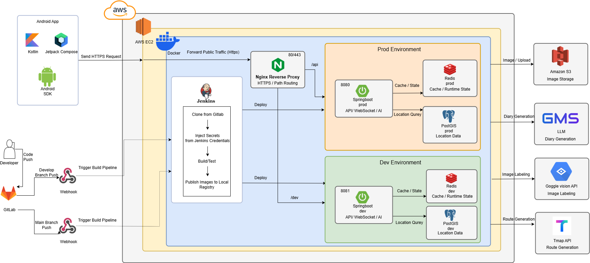

# 포팅 매뉴얼

## 목차

### [1. 기술 스택 및 버전 정보](#1-기술-스택-및-버전-정보)
### [2. 프로젝트 구조](#2-프로젝트-구조)
### [3. 로컬 빌드 및 실행 방법](#3-로컬-빌드-및-실행-방법)
### [4. Docker & Jenkins 서버 배포](#4-docker--jenkins-서버-배포)
### [5. 환경 변수 및 외부 서비스](#5-환경-변수-및-외부-서비스)
### [6. 데이터 저장소 및 네트워크 구성](#6-데이터-저장소-및-네트워크-구성)
### [7. 포팅 시 주의사항](#7-포팅-시-주의사항)

---

## 1. 기술 스택 및 버전 정보

### 1.1 협업 / 형상관리

| 영역 | 사용 도구 |
| --- | --- |
| 형상관리 | GitLab |
| CI/CD | Jenkins |
| 인프라 | AWS EC2, Docker, Nginx |

### 1.2 Backend

| 항목 | 버전 / 비고 |
| --- | --- |
| Java | 17 |
| Spring Boot | 3.5.11 |
| Gradle Wrapper | 8.14.4 |
| DB | PostgreSQL + PostGIS |
| Cache / Runtime State | Redis |
| ORM | Spring Data JPA, Hibernate Spatial |
| Security | Spring Security, JWT |
| File Storage | Amazon S3 |
| AI / 추론 | GMS(OpenAI proxy), Google Vision API, ONNX Runtime 1.18.0 |

### 1.3 Frontend

| 항목 | 버전 / 비고 |
| --- | --- |
| 앱 유형 | Android Native App |
| 언어 | Kotlin 2.0.21 |
| UI | Jetpack Compose |
| Android Gradle Plugin | 8.13.2 |
| Gradle Wrapper | 8.13 |
| Compile SDK / Target SDK | 36 / 36 |
| Min SDK | 24 |
| DI | Hilt 2.52 |
| Network | Retrofit 2.9.0, OkHttp 4.12.0 |
| 지도 | Kakao Maps 2.13.1 |
| 배포 | Firebase App Distribution |

### 1.4 Server / Proxy / CI

| 항목 | 버전 / 비고 |
| --- | --- |
| Jenkins Base Image | jenkins/jenkins:lts |
| Jenkins 노출 포트 | 9090:8080, 50000:50000 |
| Nginx Base Image | nginx:stable-alpine |
| Nginx 노출 포트 | 80:80, 443:443 |
| 공용 Docker Network | ssafy-network |

---

## 2. 프로젝트 구조

### 2.1 아키텍처 설계도



### 2.2 디렉터리 구조

```text
S14P21E108
├─ backend/                # Spring Boot API 서버
├─ frontend/               # Android Native App
├─ infra/                  # 로컬용 PostGIS / Redis compose
├─ jenkins/                # Jenkins 전용 Dockerfile / compose
├─ nginx/                  # Nginx reverse proxy 설정 및 compose
├─ docker-compose-dev.yaml # 개발 서버용 backend / db / redis
├─ docker-compose-prod.yaml# 운영 서버용 backend / db / redis
```

### 2.3 폴더별 역할

- `backend/`
  - Spring Boot 3.5.11 기반 API 서버
  - WebSocket/STOMP, Redis, PostGIS, S3, 외부 AI/API 연동 포함
- `frontend/`
  - Kotlin + Jetpack Compose 기반 Android 앱
  - `local`, `dev`, `prod` flavor 사용
- `infra/`
  - 로컬 실행용 PostGIS, Redis 컨테이너 정의
- `jenkins/`
  - Android SDK, Gradle fallback, Firebase CLI가 포함된 Jenkins 이미지 정의
- `nginx/`
  - HTTPS 종료 및 `/api`, `/dev`, `/jenkins` 경로 분기 처리

---

## 3. 로컬 빌드 및 실행 방법

## 3.1 사전 준비

- JDK 17
- Docker / Docker Compose
- Android Studio
- `frontend/app/google-services.json` 존재 확인
- 외부 API 키 및 AWS 자격 정보 준비

## 3.2 로컬 인프라 실행

로컬 백엔드는 `application-local.yaml`에서 `../infra/.env`를 참조하므로, 먼저 `infra/.env`를 준비한다.

예시:

```env
DB_PASSWORD=your-db-password
JWT_SECRET=your-jwt-secret
WEATHER_SERVICE_KEY=your-weather-key
AIR_QUALITY_SERVICE_KEY=your-air-quality-key
AWS_ACCESS_KEY=your-aws-access-key
AWS_SECRET_KEY=your-aws-secret-key
GMS_KEY=your-gms-key
TMAP_APP_KEY=your-tmap-app-key
GOOGLE_VISION_API_KEY=your-google-vision-api-key
```

로컬 DB / Redis 실행:

```bash
docker compose -f infra/docker-compose-local.yaml up -d
```

실행 컨테이너:

- PostGIS: `localhost:5432`
- Redis: `localhost:6379`

## 3.3 Backend 로컬 실행

```bash
cd backend
./gradlew bootRun --args='--spring.profiles.active=local'
```

Windows PowerShell:

```powershell
cd backend
.\gradlew.bat bootRun --args="--spring.profiles.active=local"
```

로컬 기본 접속 경로:

- API base: `http://localhost:8080/api/v1`

## 3.4 Frontend 로컬 실행 / 빌드

`frontend/.env` 파일을 생성한다.

예시:

```env
KAKAO_MAP_API_KEY=your-kakao-map-key
KAKAO_REST_API_KEY=your-kakao-rest-key
BASE_URL_LOCAL=http://10.0.2.2:8080/api/v1/
BASE_URL_DEV=https://j14e108.p.ssafy.io/dev/api/v1/
BASE_URL_PROD=https://j14e108.p.ssafy.io/api/v1/
```

Android Studio를 사용하는 경우 `local.properties`의 `sdk.dir`를 확인한다.

명령어 빌드 예시:

```bash
cd frontend
./gradlew assembleLocalDebug
./gradlew assembleDevDebug
./gradlew assembleProdRelease
```

Windows PowerShell:

```powershell
cd frontend
.\gradlew.bat assembleLocalDebug
.\gradlew.bat assembleDevDebug
.\gradlew.bat assembleProdRelease
```

로컬 에뮬레이터는 `10.0.2.2`를 통해 PC localhost 백엔드에 접근한다.

---

## 4. Docker & Jenkins 서버 배포

## 4.1 서버 사전 준비

- Ubuntu 계열 EC2 인스턴스
- Docker Engine 및 Docker Compose Plugin 설치
- `ssafy-network` 생성
- 도메인 연결 및 Let’s Encrypt 인증서 발급

공용 네트워크 생성:

```bash
docker network create ssafy-network
```

## 4.2 Jenkins 배포

Jenkins는 별도 폴더에서 커스텀 이미지로 실행한다.

실행:

```bash
cd jenkins
docker compose up -d --build
```

Jenkins 구성 특징:

- Android SDK 설치 포함
- Gradle 8.7 fallback 설치
- Firebase CLI 설치
- Docker socket 공유
- 호스트의 `/home/ubuntu/dev`, `/home/ubuntu/prod` 디렉터리 마운트

노출 포트:

- Jenkins Web UI: `9090`
- Jenkins Agent: `50000`

## 4.3 Jenkins 필수 Credentials

Jenkins 파이프라인 기준으로 다음 Credentials가 필요하다.

| Credentials ID | 타입 | 용도 |
| --- | --- | --- |
| `gitlab-auth` | Username/Password 또는 PAT | GitLab checkout |
| `be-dev-env` | Secret file | 개발 서버용 backend 환경 변수 파일 |
| `be-prod-env` | Secret file | 운영 서버용 backend 환경 변수 파일 |
| `kakao-map-api-key` | Secret text | Android 앱 빌드 시 Kakao Map API Key |
| `firebase-service-account` | Secret file | Firebase App Distribution 서비스 계정 |

## 4.4 Backend 서버용 환경 변수 파일

Jenkins는 backend 배포 시 `--env-file` 옵션으로 비밀 환경 변수 파일을 주입한다.

### 개발 서버 예시

```env
SPRING_PROFILES_ACTIVE=dev
DB_URL=jdbc:postgresql://db:5432/e108_db_dev
DB_USERNAME=postgres
DB_PASSWORD=your-dev-db-password
JWT_SECRET=your-jwt-secret
WEATHER_SERVICE_KEY=your-weather-key
AIR_QUALITY_SERVICE_KEY=your-air-quality-key
AWS_ACCESS_KEY=your-aws-access-key
AWS_SECRET_KEY=your-aws-secret-key
GMS_KEY=your-gms-key
TMAP_APP_KEY=your-tmap-key
GOOGLE_VISION_API_KEY=your-google-vision-key
```

### 운영 서버 예시

```env
SPRING_PROFILES_ACTIVE=prod
DB_URL=jdbc:postgresql://db:5432/e108_db_prod
DB_USERNAME=postgres
DB_PASSWORD=your-prod-db-password
JWT_SECRET=your-jwt-secret
WEATHER_SERVICE_KEY=your-weather-key
AIR_QUALITY_SERVICE_KEY=your-air-quality-key
AWS_ACCESS_KEY=your-aws-access-key
AWS_SECRET_KEY=your-aws-secret-key
GMS_KEY=your-gms-key
TMAP_APP_KEY=your-tmap-key
GOOGLE_VISION_API_KEY=your-google-vision-key
```

## 4.5 Backend 최초 기동

루트 기준 compose 파일을 사용한다.

### 운영 서버

```bash
docker compose -p prod -f docker-compose-prod.yaml --env-file /path/to/prod.env up -d
```

### 개발 서버

```bash
docker compose -p dev -f docker-compose-dev.yaml --env-file /path/to/dev.env up -d
```

최초 기동 후 구성:

- 운영 서버
  - App: `be-app-prod`
  - Redis: `e108-redis-prod`
  - PostGIS: `e108-postgres-prod`
- 개발 서버
  - App: `be-app-dev`
  - Redis: `e108-redis-dev`
  - PostGIS: `e108-postgres-dev`

주의:

- Jenkins는 이후 `app` 서비스만 재배포한다.
- 최초 1회는 DB / Redis / App 전체를 수동으로 올려 두는 편이 안전하다.

## 4.6 Backend Jenkins 배포 동작

Backend Jenkinsfile 기준 동작:

1. GitLab checkout
2. `backend/`에서 Gradle build
3. Docker 이미지 생성
   - `backend-app-dev`
   - `backend-app-prod`
4. `docker compose ... up -d --build --no-deps app`
5. 헬스체크
   - Dev: host `8081`
   - Prod: host `8080`

헬스체크 엔드포인트:

- `/api/v1/actuator/health`

## 4.7 Frontend Jenkins 배포 동작

Frontend Jenkinsfile 기준 동작:

1. GitLab branch checkout
2. Android SDK 경로 설정
3. APK 빌드
   - `assembleDevDebug`
   - `assembleProdRelease`
4. Dev 빌드 결과를 Firebase App Distribution으로 배포

현재 상태:

- Dev APK 배포 활성화
- Prod Firebase 배포 stage는 주석 처리되어 있음

## 4.8 Nginx 배포

Nginx는 별도 폴더에서 실행한다.

실행:

```bash
cd nginx
docker compose up -d
```

Nginx 역할:

- `80 -> 443` 리다이렉트
- HTTPS 종료
- WebSocket upgrade 처리
- 경로 기반 분기

라우팅 규칙:

- `/api/` -> `be-app-prod:8080`
- `/dev/` -> `be-app-dev:8080`
  - `/dev/` 접두어 제거 후 프록시
- `/jenkins/` -> `jenkins:8080`

필수 조건:

- `/etc/letsencrypt/live/j14e108.p.ssafy.io/` 하위 인증서 존재
- `be-app-prod`, `be-app-dev`, `jenkins` 컨테이너가 모두 `ssafy-network`에 연결되어 있어야 함

---

## 5. 환경 변수 및 외부 서비스

## 5.1 Backend 주요 환경 변수

| 변수명 | 설명 |
| --- | --- |
| `SPRING_PROFILES_ACTIVE` | 실행 프로파일 (`local`, `dev`, `prod`) |
| `DB_URL` | PostgreSQL/PostGIS JDBC URL |
| `DB_USERNAME` | DB 사용자명 |
| `DB_PASSWORD` | DB 비밀번호 |
| `JWT_SECRET` | JWT 서명 키 |
| `WEATHER_SERVICE_KEY` | 기상 API 키 |
| `AIR_QUALITY_SERVICE_KEY` | 대기질 API 키 |
| `AWS_ACCESS_KEY` | S3 접근 키 |
| `AWS_SECRET_KEY` | S3 비밀 키 |
| `GMS_KEY` | GMS(OpenAI proxy) 접근 키 |
| `TMAP_APP_KEY` | TMAP 보행 경로 API 키 |
| `GOOGLE_VISION_API_KEY` | Google Vision API 키 |
| `EMOTION_MODEL_PATH` | ONNX 모델 경로, 기본값 `models/dog.onnx` |

## 5.2 Frontend 주요 환경 변수

| 변수명 | 설명 |
| --- | --- |
| `KAKAO_MAP_API_KEY` | Kakao 지도 SDK 키 |
| `KAKAO_REST_API_KEY` | Kakao REST API 키 |
| `BASE_URL_LOCAL` | 로컬 백엔드 주소 |
| `BASE_URL_DEV` | 개발 서버 주소 |
| `BASE_URL_PROD` | 운영 서버 주소 |

## 5.3 외부 서비스 목록

| 서비스 | 용도 |
| --- | --- |
| Amazon S3 | 이미지 업로드 및 저장 |
| GMS(OpenAI proxy) | 일기 생성 LLM 호출 |
| Google Vision API | 이미지 라벨링 / 강아지 포함 여부 판별 |
| TMAP Pedestrian API | 산책 경로 생성 |
| 기상청 API | 날씨 정보 조회 |
| 대기질 API | 미세먼지 / 공기질 조회 |
| Firebase App Distribution | Android Dev APK 배포 |

## 5.4 프로젝트에서 사용하는 외부 서비스 정보

이미지 업로드, AI 연동, 지도/공공데이터 조회, Android 배포에 필요한 외부 서비스 정보를 정리한다.

참고:

- 현재 프로젝트에는 소셜 로그인 기능이 없으므로 소셜 인증용 외부 서비스는 사용하지 않는다.
- 아래 표는 포팅 시 실제로 가입/발급/준비가 필요한 서비스만 정리한 것이다.

| 서비스 | 준비해야 하는 정보 | 사용 위치 | 포팅 시 해야 할 일 |
| --- | --- | --- | --- |
| GitLab | 저장소 접근 계정 또는 PAT, Jenkins용 `gitlab-auth` Credential | Jenkins Backend / Frontend pipeline | Jenkins에서 소스 checkout 가능하도록 계정 또는 토큰 준비 |
| Amazon S3 | S3 버킷, IAM Access Key / Secret Key | Backend `AWS_ACCESS_KEY`, `AWS_SECRET_KEY`, `aws.s3.bucket` | 버킷 생성 또는 기존 버킷 권한 확인, 업로드/삭제 가능한 IAM 사용자 발급 |
| GMS(OpenAI proxy) | `GMS_KEY` | Backend `api.gms.api-key` | 서비스 접근 키 발급 후 backend env 파일에 설정 |
| Google Vision API | `GOOGLE_VISION_API_KEY` | Backend `google.vision.api-key` | Google Cloud 프로젝트에서 Vision API 활성화 후 API 키 발급 |
| TMAP API | `TMAP_APP_KEY` | Backend `api.tmap.app-key` | SK Open API 앱 등록 후 보행 경로 API 키 발급 |
| 기상청 API | `WEATHER_SERVICE_KEY` | Backend `api.weather.service-key` | 공공데이터포털에서 활용 신청 후 서비스 키 발급 |
| 대기질 API | `AIR_QUALITY_SERVICE_KEY` | Backend `api.air-quality.service-key` | 공공데이터포털에서 활용 신청 후 서비스 키 발급 |
| Kakao Maps SDK / REST API | `KAKAO_MAP_API_KEY`, `KAKAO_REST_API_KEY` | Frontend `.env`, Jenkins `kakao-map-api-key` | Kakao Developers 앱 생성 후 Android SDK 키와 REST API 키 준비 |
| Firebase Project | `google-services.json`, Firebase App ID, 서비스 계정 JSON | Android 앱, Jenkins Firebase 배포 | Firebase 프로젝트 생성, Android 앱 등록, `google-services.json` 배치, App Distribution 서비스 계정 발급 |
| Let's Encrypt | 도메인, 인증서 파일 | Nginx `/etc/letsencrypt` 마운트 | 배포 서버 도메인 연결 후 인증서 발급 및 자동 갱신 정책 준비 |

## 5.5 외부 서비스별 세부 준비물

### 5.5.1 Amazon S3

- 용도: 산책 사진, 장소 이미지, 데모 이미지 저장
- 준비물:
  - S3 버킷
  - IAM 사용자 Access Key / Secret Key
  - 버킷 업로드 / 삭제 권한
- 적용 위치:
  - backend env 파일의 `AWS_ACCESS_KEY`, `AWS_SECRET_KEY`
  - `backend/src/main/resources/application.yaml`의 bucket / region

### 5.5.2 GMS(OpenAI proxy)

- 용도: 일기 생성용 LLM 호출
- 준비물:
  - 서비스 접근 API Key
- 적용 위치:
  - backend env 파일의 `GMS_KEY`

### 5.5.3 Google Vision API

- 용도: 이미지 라벨링, 강아지 포함 여부 판별
- 준비물:
  - Google Cloud 프로젝트
  - Vision API 활성화
  - API Key
- 적용 위치:
  - backend env 파일의 `GOOGLE_VISION_API_KEY`

### 5.5.4 TMAP / 공공데이터 API

- TMAP
  - 준비물: `TMAP_APP_KEY`
  - 용도: 보행 경로 생성
- 기상청 API
  - 준비물: `WEATHER_SERVICE_KEY`
  - 용도: 날씨 조회
- 대기질 API
  - 준비물: `AIR_QUALITY_SERVICE_KEY`
  - 용도: 미세먼지 / 공기질 조회
- 적용 위치:
  - 모두 backend env 파일에서 주입

### 5.5.5 Kakao Developers

- 용도:
  - Android 지도 SDK 초기화
  - 장소 검색 / 주소 검색 등 REST 호출
- 준비물:
  - Android 플랫폼 등록
  - `KAKAO_MAP_API_KEY`
  - `KAKAO_REST_API_KEY`
- 적용 위치:
  - Frontend `.env`
  - Jenkins `kakao-map-api-key` Credential

### 5.5.6 Firebase

- 용도:
  - Android 앱 Firebase 연동
  - Dev APK App Distribution 배포
- 준비물:
  - Firebase 프로젝트
  - Android 앱 등록
  - `frontend/app/google-services.json`
  - Firebase App ID
  - 서비스 계정 JSON 파일
- 적용 위치:
  - 앱 빌드: `frontend/app/google-services.json`
  - Jenkins 배포: `firebase-service-account` Credential
  - `frontend/Jenkinsfile`의 `FIREBASE_APP_ID`

### 5.5.7 Let's Encrypt / 도메인

- 용도:
  - Nginx HTTPS 종료
- 준비물:
  - 도메인 DNS 연결
  - `/etc/letsencrypt/live/j14e108.p.ssafy.io/` 인증서 파일
- 적용 위치:
  - `nginx/default.conf`
  - `nginx/docker-compose.yaml`의 `/etc/letsencrypt` 마운트

## 5.6 포팅 체크리스트

- GitLab 접근용 Jenkins Credential 생성
- Backend dev / prod env 파일 생성
- S3 IAM 키 발급 및 버킷 권한 확인
- GMS API Key 준비
- Google Vision API 활성화 및 API Key 준비
- TMAP App Key 준비
- 기상청 / 대기질 API 서비스 키 준비
- Kakao Map / REST API 키 준비
- Firebase 프로젝트 및 서비스 계정 준비
- `frontend/app/google-services.json` 배치
- 도메인 DNS 연결 및 Let's Encrypt 인증서 준비

---

## 6. 데이터 저장소 및 네트워크 구성

## 6.1 데이터 저장소

| 저장소 | 환경 | 포트 | 비고 |
| --- | --- | --- | --- |
| PostGIS | local | 5432 | `infra/docker-compose-local.yaml` |
| PostGIS | dev | 5433 -> 5432 | 호스트 `~/postgres/dev/data` 사용 |
| PostGIS | prod | 5432 | 호스트 `~/postgres/prod/data` 사용 |
| Redis | local | 6379 | 로컬 캐시 / 상태 저장 |
| Redis | dev | 6380 -> 6379 | 개발 서버용 |
| Redis | prod | 6379 | 운영 서버용 |
| S3 | 공통 | - | 이미지 저장 |

## 6.2 네트워크

- `ssafy-network`
  - Nginx, Jenkins, `be-app-dev`, `be-app-prod`를 연결하는 공용 external network
- `e108-network-dev`
  - 개발 서버 내부 App / DB / Redis 전용 bridge network
- `e108-network-prod`
  - 운영 서버 내부 App / DB / Redis 전용 bridge network
- `e108-local-network`
  - 로컬 PostGIS / Redis 전용 bridge network

---

## 7. 포팅 시 주의사항

## 7.1 `.md` 기본 ignore 정책

루트 `.gitignore`에 `*.md`가 있어 Markdown 파일이 기본적으로 ignore된다.

본 문서 추적을 위해 `.gitignore`에 아래 예외가 추가되어 있어야 한다.

```gitignore
!exec/porting_manual.md
```

## 7.2 Nginx는 공용 진입점이다

- 외부 요청은 모두 Nginx를 먼저 통과한다.
- 운영 API는 `/api/`
- 개발 API는 `/dev/`
- Jenkins UI는 `/jenkins/`
- 따라서 Nginx가 내려가면 앱 API와 Jenkins 접근이 모두 영향을 받는다.

## 7.3 Jenkins와 Backend 컨테이너 이름 의존성

Nginx upstream은 아래 이름에 직접 의존한다.

- `be-app-prod`
- `be-app-dev`
- `jenkins`

컨테이너 이름이 바뀌면 `nginx/default.conf`도 함께 수정해야 한다.

## 7.4 Backend Jenkinsfile 주의

현재 backend Jenkinsfile의 checkout stage는 `develop` 브랜치를 고정 checkout한다.

즉, 운영 포팅 시에는 아래 중 하나를 검토해야 한다.

- multibranch pipeline에 맞게 checkout 로직 수정
- prod 전용 Jenkins job 분리
- checkout branch를 `env.BRANCH_NAME` 기반으로 변경

## 7.5 운영 compose 환경 변수 누락 가능성

현재 `docker-compose-prod.yaml`에는 아래 환경 변수 pass-through가 보이지 않는다.

- `DB_USERNAME`
- `GOOGLE_VISION_API_KEY`

실제 운영 포팅 전에는 다음 중 하나가 필요하다.

- compose 파일에 환경 변수 추가
- app 설정 기본값 정리
- 다른 방식으로 컨테이너 내부에 주입되는지 검증

## 7.6 로컬 프로파일은 `infra/.env`에 의존한다

`backend/src/main/resources/application-local.yaml`은 `../infra/.env`를 import한다.

즉, local 실행 시 backend 폴더 안이 아니라 `infra/.env`를 먼저 준비해야 한다.

## 7.7 Frontend Firebase 배포

- Dev Firebase 배포만 활성화되어 있다.
- Prod Firebase 배포 stage는 주석 처리되어 있으므로 필요 시 복구해야 한다.

## 7.8 Jenkins Docker 마운트 경로

`jenkins/docker-compose.yaml`은 아래 경로를 직접 마운트한다.

- `/usr/bin/docker`
- `/usr/libexec/docker/cli-plugins`

호스트 OS / Docker 설치 방식에 따라 경로가 다를 수 있으므로, 포팅 대상 서버에서 실제 경로를 먼저 확인해야 한다.

---

## 부록: 빠른 실행 순서

### 로컬

```bash
docker compose -f infra/docker-compose-local.yaml up -d
cd backend && ./gradlew bootRun --args='--spring.profiles.active=local'
cd frontend && ./gradlew assembleLocalDebug
```

### 서버 최초 세팅

```bash
docker network create ssafy-network
cd jenkins && docker compose up -d --build
cd /path/to/repo && docker compose -p prod -f docker-compose-prod.yaml --env-file /path/to/prod.env up -d
cd /path/to/repo && docker compose -p dev -f docker-compose-dev.yaml --env-file /path/to/dev.env up -d
cd nginx && docker compose up -d
```

### 운영 중 재배포

- Backend: Jenkins가 `docker compose ... up -d --build --no-deps app` 수행
- Frontend: Jenkins가 APK 빌드 후 Firebase App Distribution 배포
